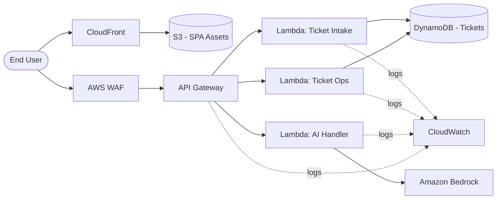
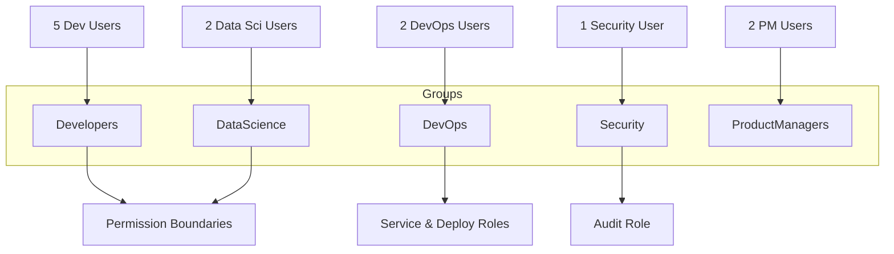

# SwiftSupport — AWS Security Hardening & IAM Governance

> Cloud Engineering consulting engagement: re-architecting a functional-but-insecure AWS workload into a least-privilege, role-based, auditable environment — delivered as Infrastructure as Code with the AWS CDK.


---

## Table of Contents

1. [Engagement Overview](#engagement-overview)
2. [Client Background](#client-background)
3. [Current Architecture](#current-architecture)
4. [Security Gap Analysis](#security-gap-analysis)
5. [Target Architecture & Approach](#target-architecture--approach)
6. [Account Governance (AWS Organizations + Root)](#account-governance-aws-organizations--root)
7. [IAM Design](#iam-design)
8. [Permissions Matrix](#permissions-matrix)
9. [Service-Level Security Hardening](#service-level-security-hardening)
10. [Repository Structure](#repository-structure)
11. [Deployment](#deployment)
12. [Documentation & Screenshots](#documentation--screenshots)
13. [Skills Demonstrated](#skills-demonstrated)

---

## Engagement Overview

**Client:** SwiftSupport — a growing startup whose AI-powered customer-support ticketing platform now serves several downstream clients.

**Problem:** The platform was shipped optimizing for functionality, not security. The 12-person team shares a single set of AWS credentials, there is no IAM structure, and individual services run with minimal access controls. As the platform now handles other companies' customer data, security has become a business requirement, not a nice-to-have.

**My role:** Cloud Engineer Consultant brought in to document the existing system, identify risk, and re-platform access control and service security around AWS Well-Architected and least-privilege principles — codified so it's repeatable, reviewable, and auditable rather than click-ops.

---

## Client Background

| Item | Detail |
|---|---|
| Team size | 12 employees |
| Current access model | Shared AWS credentials, no role separation |
| Deployment process | None standardized |
| Data sensitivity | Handling support tickets on behalf of multiple client organizations |

### Team Structure & Access Needs

| Role | Headcount | Access Requirement |
|---|---|---|
| Developers | 5 | Lambda, API Gateway, DynamoDB (limited) |
| DevOps Engineers | 2 | Full infrastructure management |
| Security Specialist | 1 | WAF, IAM, CloudWatch |
| Data Scientists | 2 | Bedrock, read-only DynamoDB |
| Product Managers | 2 | Read-only monitoring + cost data |

---

## Current Architecture

The existing system is a serverless web application:

- **Single Page Application** served via **CloudFront** + **S3** (private origin).
- **AWS WAF** in front of the distribution / API.
- **API Gateway** routing requests to the backend.
- **Multiple Lambda functions** handling discrete operations.
- **DynamoDB** as the ticket data store.
- **Amazon Bedrock** performing the AI ticket processing.
- **CloudWatch** for logging and monitoring.



> A higher-resolution architecture diagram is in [`/docs/diagrams/`](docs/diagrams).

---

## Security Gap Analysis

| # | Gap | Risk | Severity |
|---|---|---|---|
| 1 | Shared AWS credentials across 12 people | No attribution, no accountability, single leaked key compromises everything | **Critical** |
| 2 | No IAM users/groups/roles | No least privilege; everyone effectively has the same broad access | **Critical** |
| 3 | Root account in active use / unhardened | Root has unrestricted power and can bypass IAM policies | **Critical** |
| 4 | No MFA enforcement | Credential theft leads directly to account takeover | **High** |
| 5 | Lambda functions likely over-permissioned | Blast radius if any function is compromised | **High** |
| 6 | API Gateway authorization unclear | Potential unauthenticated access to backend operations | **High** |
| 7 | Broad/unscoped DynamoDB access | Cross-tenant data exposure of customer tickets | **High** |
| 8 | WAF rules not tuned to the app | False sense of protection; common attacks may pass | **Medium** |
| 9 | No standardized, reviewable deployment | Configuration drift, no change history, no rollback | **Medium** |
| 10 | No centralized guardrails / no Organizations | Cannot enforce org-wide controls or separate environments | **Medium** |

---

## Target Architecture & Approach

The remediation is delivered as **AWS CDK** so every control is version-controlled, peer-reviewable in pull requests, and reproducible across environments. This directly fixes Gap #9 (no standardized deployment) while implementing the rest.

Guiding principles:

- **Least privilege** — every identity gets only the actions and resources it needs.
- **Separation of duties** — group-based permissions mapped to job function.
- **Defense in depth** — controls layered at the account, identity, and service level.
- **Auditability** — CloudTrail + CloudWatch so every action is attributable to a person or role.
- **Everything as code** — no manual console changes for repeatable controls.

> **Modern best practice note:** For human access, **IAM Identity Center (SSO)** with permission sets is the recommended pattern over long-lived IAM users. This project implements the **IAM users/groups/roles** structure as scoped by the engagement, and documents the Identity Center migration path in [`/docs/identity-center-roadmap.md`](docs/identity-center-roadmap.md).

---

## Account Governance (AWS Organizations + Root)

### AWS Organizations

- Created an Organization with a **management (payer) account** and separated workloads into **Organizational Units (OUs)** — e.g., `Security`, `Workloads/Prod`, `Workloads/Dev`, `Sandbox`.
- Applied **Service Control Policies (SCPs)** as preventative guardrails, for example:
  - Deny disabling CloudTrail / GuardDuty.
  - Deny use of the root user for day-to-day actions.
  - Restrict usable regions to those the business operates in.
  - Deny deletion of audit/log buckets.

### Root Account Hardening

- Enabled **MFA** on the root user (hardware/virtual).
- **Removed all root access keys.**
- Set a strong, vaulted root password; locked away credentials.
- Configured **alternate contacts** (security, billing, operations).
- Root is reserved only for the small set of [tasks that require it](https://docs.aws.amazon.com/IAM/latest/UserGuide/root-user-tasks.html).

### Credential Management Best Practices

- No more shared credentials — every person gets an individual identity.
- **MFA required** for all human users.
- Strong account-wide **password policy** (length, rotation, reuse prevention).
- Programmatic access via **IAM roles** (e.g., for CI/CD and service-to-service), not static keys where avoidable.
- **Access keys rotated** and unused credentials disabled (surfaced by IAM credential reports / Access Analyzer).

---

## IAM Design

Access is assigned through **groups**, never directly to users. Workloads and cross-account/CI access use **roles** so credentials are short-lived.



- **Permission boundaries** are attached to Developer and Data Science identities to cap the maximum permissions they can ever obtain, even if a policy is later misconfigured.
- **Service roles** (Lambda execution roles, CI/CD deploy roles) are defined per-function/per-pipeline rather than reused, keeping blast radius small.

---

## Permissions Matrix

> Custom policies are scoped to specific ARNs (function names, table names, log groups). Managed policies are used where they already represent least privilege for the role.

| Team | Allowed Actions (summary) | Implementation |
|---|---|---|
| **Developers** | Develop/deploy Lambda; configure API Gateway; limited DynamoDB; view CloudWatch logs | `AmazonAPIGatewayAdministrator` + scoped custom policies for Lambda (project functions only), DynamoDB (specific tables, no destructive actions), `CloudWatchLogsReadOnlyAccess`. Permission boundary applied. |
| **DevOps** | Full infrastructure management; CI/CD; resource provisioning; full CloudWatch | Broad managed access (`PowerUserAccess` baseline) plus a dedicated **deploy role** assumed by the pipeline; CloudWatch full access. |
| **Security Specialist** | WAF config; IAM administration; CloudWatch logs & alarms; security audit | `AWSWAFv2FullAccess` (or scoped), `IAMFullAccess`, `CloudWatchFullAccess`, `SecurityAudit`. |
| **Data Scientists** | Full Bedrock; read-only DynamoDB; access to AI-component Lambdas | `AmazonBedrockFullAccess`, `AmazonDynamoDBReadOnlyAccess`, scoped Lambda access to AI functions. Permission boundary applied. |
| **Product Managers** | CloudWatch dashboards; Cost Explorer & Budgets; read-only resource visibility | `CloudWatchReadOnlyAccess`, billing/Cost Explorer read access, `ViewOnlyAccess`. |

Full JSON policy documents live in [`/iam/policies/`](iam/policies).

---

## Service-Level Security Hardening

### Lambda
- Each function gets its **own least-privilege execution role** (no shared role).
- DynamoDB grants scoped to the **specific table and item-level actions** the function needs (`GetItem`/`Query` vs. `PutItem`/`DeleteItem`).
- Environment secrets pulled from **Secrets Manager**/SSM Parameter Store, not hardcoded.

### API Gateway
- Authorization enforced — **Cognito user pools** or **IAM/Lambda authorizers** in front of protected routes.
- **Throttling and usage plans** to limit abuse.
- Access logging to CloudWatch; request validation enabled.

### DynamoDB
- Access governed by **IAM policy conditions** (e.g., `dynamodb:LeadingKeys`) so identities can only reach their permitted partition keys.
- **Encryption at rest** (AWS-managed/CMK) and point-in-time recovery enabled.
- Read-only roles cannot perform write/delete actions.

### WAF
- Tuned **AWS Managed Rule Groups** (Core, Known Bad Inputs, SQLi) for the app's actual traffic.
- **Rate-based rules** to blunt brute-force / scraping.
- Logging enabled for tuning and incident review.

### CloudFront
- **Origin Access Control (OAC)** so S3 is reachable only through CloudFront, never directly.
- HTTPS enforced (redirect HTTP → HTTPS), modern TLS policy.
- **Security response headers** (HSTS, CSP, X-Content-Type-Options) via response headers policy.

### Service-to-Service Authentication
- Services communicate via **IAM roles**, not stored keys.
- **CloudTrail** records every API call; CloudWatch alarms flag anomalous activity (e.g., root usage, IAM policy changes, failed auth spikes).

---

## Repository Structure

```
.
├── README.md
├── cdk/                      # AWS CDK app (TypeScript/Python)
│   ├── bin/
│   ├── lib/
│   │   ├── org-governance-stack.*   # Organizations, SCPs
│   │   ├── iam-stack.*              # groups, users, roles, boundaries
│   │   ├── lambda-stack.*          # functions + scoped exec roles
│   │   ├── api-stack.*             # API Gateway + authorizers
│   │   ├── data-stack.*            # DynamoDB + access controls
│   │   ├── edge-stack.*            # CloudFront, S3, WAF
│   │   └── monitoring-stack.*      # CloudWatch, CloudTrail, alarms
│   └── test/
├── iam/
│   └── policies/             # JSON policy documents per team
├── docs/
│   ├── diagrams/             # architecture diagrams
│   ├── identity-center-roadmap.md
│   └── screenshots/          # console evidence
└── scps/                     # service control policies
```

---

## Deployment

> Prerequisites: AWS CLI configured, Node.js + AWS CDK installed, appropriate management-account permissions.

```bash
# install dependencies
npm install

# bootstrap the environment (once per account/region)
cdk bootstrap

# preview changes
cdk diff

# deploy a specific stack
cdk deploy IamStack

# deploy everything
cdk deploy --all
```

---

## Documentation & Screenshots

Evidence and write-ups are stored in [`/docs`](docs):

- **Architecture write-up** — current architecture and its vulnerabilities, the remediation approach, and the reasoning behind each permission structure.
- **Screenshots** (in [`/docs/screenshots`](docs/screenshots)):
  - IAM groups, users, and roles structure
  - Security configurations for WAF, API Gateway, and Lambda
  - Permission boundaries and policies per team
  - CloudWatch monitoring and alerting setup
  - How service-to-service authentication is secured

---

## Skills Demonstrated

- AWS Organizations, SCPs, and account governance
- IAM least-privilege design: groups, roles, permission boundaries, policy conditions
- Securing serverless workloads (Lambda, API Gateway, DynamoDB, Bedrock)
- Edge security (CloudFront OAC, WAF tuning, security headers)
- Monitoring, auditing, and alerting (CloudTrail, CloudWatch)
- Infrastructure as Code with the AWS CDK
- Security gap analysis and remediation planning

---

*Engagement deliverable. Architecture, policies, and screenshots reflect a security-hardening pass over a pre-existing AWS workload.*
